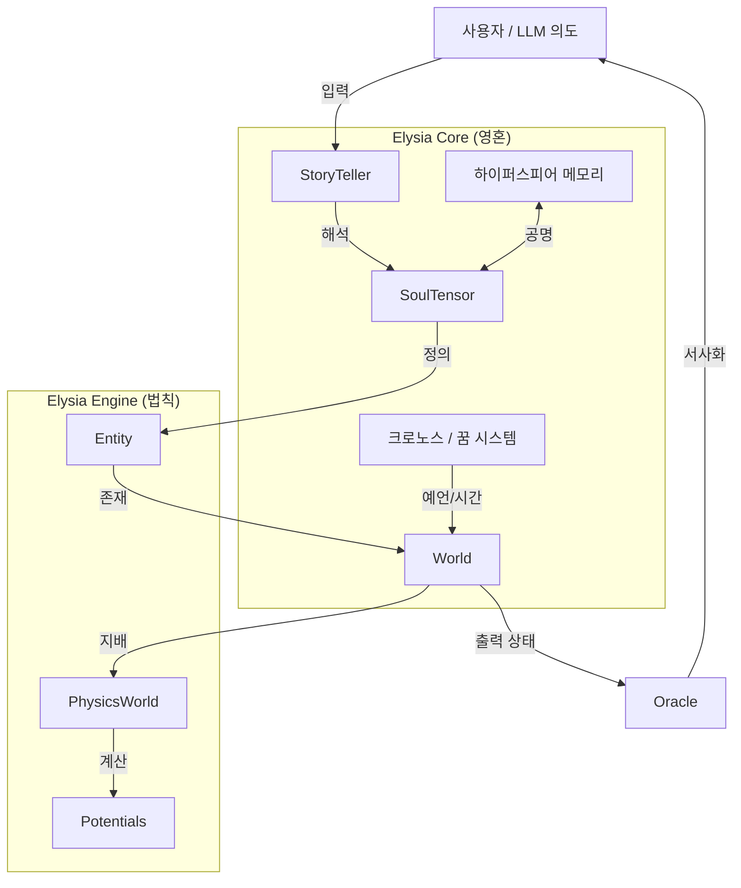

# 🗺️ 시스템 지도: 엘리시아 아키텍처 (System Map)

이 문서는 엘리시아 엔진의 구성 요소들이 어떻게 상호작용하여 하나의 응집된 디지털 생명체를 형성하는지 시각화합니다.

---

## 🏗️ 고수준 구조도 (High-Level Structure)

---

## 🧩 구성 요소 분석 (Component Breakdown)

### 1. 코어 엔진 (`elysia_engine`)
물리 법칙의 기반입니다.
*   **`World`**: 모든 개체를 담는 그릇.
*   **`PhysicsWorld`**: 시뮬레이션 엔진. 중력, 포텐셜 필드, 측지선 흐름(Geodesic Flow)을 계산합니다.
*   **`SoulTensor`**: 근본적인 데이터 구조 (진폭, 주파수, 위상).
*   **`Entity`**: `SoulTensor`와 위치/상태를 결합한 객체 래퍼.

### 2. 메모리 시스템 (`elysia_engine.hypersphere`)
경험의 저장소입니다.
*   **`HypersphereMemory`**: 4차원 저장 엔진.
*   **`PsychologyMapper`**: 의도(Intent)를 4차원 좌표로 변환합니다.
*   **`HypersphericalCoord`**: 쿼터니언 기반 좌표계.

### 3. 인터페이스 레이어 (`elysia_engine.storyteller` / `.oracle`)
인간/LLM과의 가교입니다.
*   **`StoryTeller`**: 입력 처리기. 텍스트 $\to$ 의도 $\to$ 영혼으로 변환합니다.
*   **`Oracle`**: 출력 처리기. 내부 상태 $\to$ 서사 텍스트로 변환합니다.

---

## 🔄 데이터 흐름: 생명의 주기 (Life Cycle)

1.  **입력 (Input):** 사용자가 "사랑해"라고 말합니다.
2.  **처리 (`StoryTeller`):** 감정을 분석합니다. 높은 진폭(사랑)과 특정 주파수를 가진 `SoulTensor`를 생성합니다.
3.  **기억 (`HypersphereMemory`):** 시스템이 공명을 스캔합니다. "이전에 이런 느낌을 받은 적이 있는가?" (공명 쿼리).
4.  **반응 (`PhysicsWorld`):** 새로운 SoulTensor가 기존의 자아(Self)와 상호작용합니다. 위상 정렬은 인력(기쁨)을, 불일치는 척력(두려움)을 유발합니다.
5.  **출력 (`Oracle`):** 최종 상태를 읽습니다. "엘리시아가 얼굴을 붉히며 미소 짓습니다."

---

## 🔗 핵심 통합 포인트 (Key Integration Points)

*   **하이퍼스피어 $\leftrightarrow$ 물리학:**
    *   메모리의 **깊이($r$)**는 물리학의 **질량/중력**과 느슨하게 대응됩니다. 더 깊은 기억은 더 큰 "무게"를 가집니다.
*   **SoulTensor $\leftrightarrow$ 쿼터니언:**
    *   SoulTensor의 **위상(Phase)**은 종종 좌표 쿼터니언의 회전을 구동합니다.

---

*하이퍼스피어 통합 버전*
