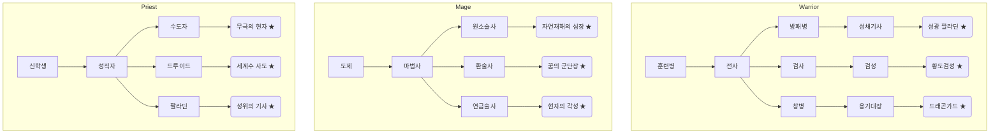

# 직업별 Trinity Weights 매뉴얼

이 문서는 7개 직업 계열(전사·마법사·성직자·도적·상인·귀족·장인)의 **초기 Body/Soul/Spirit 가중치**와 전직 트리를 정리한 참조표입니다.  
빠르게 다이어그램을 그리고 싶다면 아래 트리를 그대로 Mermaid나 OmniGraffle 등에 복붙해도 될 정도로 계층이 정의되어 있습니다.

## 0. 기본 스탯 / 역할 체계

모든 직업은 다음 5대 스탯을 가진다.

| 스탯 | 의미 | 설명 |
| --- | --- | --- |
| 힘 STR | 물리 공격력 | 무기 데미지, 방패 밀어내기, 근딜 계열 |
| 민첩 AGI | 기동/회피/정밀 | 도적·궁수·요원 등 |
| 체력 STA | HP/버티기 | 탱커, 전사, |
| 지능 INT | 주문 위력 | 마법 딜러, 공학자 |
| 지혜 WIS | 정신/신념/힐 | 성직, 버퍼, 예언자 |

역할 구분은 다음과 같이 정리한다.

| 역할 | 설명 | 대표 직업 |
| --- | --- | --- |
| 탱커 Tank | 버티면서 어그로 | 방패병, 성채기사 |
| 근딜 Melee DPS | 근접 딜러 | 검사, 도적, 암살자 |
| 원딜 Ranged DPS | 활·총·투척 | 궁수, 레인저 |
| 마법 딜 Spell DPS | 주문 화력 | 원소술사, 환술사 |
| 힐러 Healer | 회복·정화 | 성직자, 수도자 |
| 버퍼 Buffer | 강화·약화 | 사절, 음유시인, 버서커 샤우트 |

기본 파티 조합 (예쁜 5인 구성) :
**탱커** + **근딜 도적** + **마법사** + **원딜 궁수** + **힐러**.

이 섹션에서 정의한 스탯/역할 태그는 아래 계열별 표에 추가된 `STR/AGI/STA/INT/WIS` 열과 `주역할` 열에서 확인할 수 있다.

---

## 1. 계열 개요

| 계열 | 중심 축 | 주요 역할 |
| --- | --- | --- |
| 전사 (Warrior) | Body | 방패병, 검사, 창병, 전투 지휘관 |
| 마법사 (Mage) | Soul | 마법사, 연금술사, 환술사, 학자 |
| 성직자 (Priest) | Spirit | 사제, 팔라딘, 드루이드, 예언자 |
| 도적 (Rogue) | Body/Soul 믹스 | 도적, 잠입수, 추적자, 그림자 |
| 상인 (Merchant) | Soul | 상인, 중개인, 카르텔 운영자 |
| 귀족 (Noble) | Spirit/Soul | 귀족, 외교관, 통치자, 사절 |
| 장인 (Artisan) | Body/Soul | 대장장이, 기술자, 건축가, 연금장 |

---

## 2. 전사 계열 (Body 라인)

| 직업 | Body | Soul | Spirit | STR | AGI | STA | INT | WIS | 주역할 |
| --- | --- | --- | --- | --- | --- | --- | --- | --- | --- |
| 전사 Warrior | **0.60** | 0.25 | 0.15 | 8 | 5 | 7 | 3 | 3 | 근딜/서브탱 |
| 방패병 Guardian | **0.55** | **0.35** | 0.10 | 7 | 4 | 9 | 2 | 3 | 탱커 |
| 검사 Swordsman | **0.65** | 0.25 | 0.10 | 8 | 7 | 6 | 3 | 2 | 근딜 |
| 창병 Lancer | **0.62** | 0.23 | 0.15 | 7 | 6 | 7 | 3 | 3 | 돌격/CC |
| 광전사 Berserker | **0.70** | 0.15 | 0.15 | 9 | 5 | 6 | 2 | 3 | 버프/근딜 |

---

## 3. 마법사 계열 (Soul 라인)

| 직업 | Body | Soul | Spirit | STR | AGI | STA | INT | WIS | 주역할 |
| --- | --- | --- | --- | --- | --- | --- | --- | --- | --- |
| 마법사 Wizard | 0.20 | **0.60** | 0.20 | 2 | 4 | 3 | 9 | 6 | 마딜 |
| 연금술사 Alchemist | 0.25 | **0.55** | 0.20 | 3 | 4 | 4 | 8 | 6 | 버퍼/유틸 |
| 환술사 Illusionist | 0.20 | **0.55** | 0.25 | 2 | 5 | 3 | 8 | 7 | 디버퍼 |
| 학자 Scholar | 0.15 | **0.65** | 0.20 | 2 | 4 | 3 | 8 | 8 | 컨트롤 |
| 원소술사 Elementalist | 0.25 | **0.55** | 0.20 | 3 | 4 | 4 | 9 | 6 | 광역딜 |

---

## 4. 성직자 계열 (Spirit 라인)

| 직업 | Body | Soul | Spirit | STR | AGI | STA | INT | WIS | 주역할 |
| --- | --- | --- | --- | --- | --- | --- | --- | --- | --- |
| 성직자 Priest | 0.20 | 0.30 | **0.50** | 2 | 3 | 4 | 6 | 9 | 힐러 |
| 팔라딘 Paladin | 0.40 | 0.20 | **0.40** | 7 | 4 | 7 | 4 | 7 | 탱커/힐 |
| 드루이드 Druid | 0.25 | 0.25 | **0.50** | 3 | 5 | 5 | 6 | 8 | 힐/버퍼 |
| 예언자 Oracle | 0.10 | 0.25 | **0.65** | 1 | 3 | 3 | 6 | 10 | 버퍼 |
| 수도자 Monk | 0.30 | 0.20 | **0.50** | 6 | 6 | 6 | 4 | 7 | 근딜/힐 |

---

## 5. 도적 계열 (Rogue 라인)

| 직업 | Body | Soul | Spirit | STR | AGI | STA | INT | WIS | 주역할 |
| --- | --- | --- | --- | --- | --- | --- | --- | --- | --- |
| 도적 Rogue | **0.55** | 0.30 | 0.15 | 6 | 8 | 5 | 4 | 3 | 근딜/유틸 |
| 그림자 Shadow | **0.50** | 0.30 | 0.20 | 5 | 9 | 4 | 4 | 4 | 잠입 |
| 추적자 Ranger | **0.50** | 0.35 | 0.15 | 5 | 7 | 5 | 5 | 4 | 원딜 |
| 암살자 Assassin | **0.60** | 0.20 | 0.20 | 8 | 9 | 4 | 4 | 3 | 버스트 딜 |
| 요원 Operative | 0.45 | **0.40** | 0.15 | 5 | 7 | 4 | 5 | 4 | 버퍼/디버프 |

---

## 6. 상인 계열 (Merchant 라인)

| 직업 | Body | Soul | Spirit | STR | AGI | STA | INT | WIS | 주역할 |
| --- | --- | --- | --- | --- | --- | --- | --- | --- | --- |
| 상인 Merchant | 0.30 | **0.55** | 0.15 | 3 | 5 | 4 | 6 | 5 | 버퍼 |
| 중개인 Broker | 0.25 | **0.60** | 0.15 | 2 | 5 | 3 | 6 | 6 | 버퍼/디버퍼 |
| 카라반 마스터 Caravan Master | 0.35 | **0.50** | 0.15 | 4 | 5 | 5 | 5 | 5 | 서포트 |
| 밀수업자 Smuggler | 0.40 | 0.45 | 0.15 | 5 | 6 | 4 | 4 | 4 | 근딜/유틸 |
| 은행가 Banker | 0.25 | **0.50** | 0.25 | 2 | 4 | 3 | 7 | 7 | 버퍼 |

---

## 7. 귀족 계열 (Noble 라인)

| 직업 | Body | Soul | Spirit | STR | AGI | STA | INT | WIS | 주역할 |
| --- | --- | --- | --- | --- | --- | --- | --- | --- | --- |
| 귀족 Noble | 0.25 | 0.35 | **0.40** | 4 | 5 | 4 | 6 | 7 | 버퍼 |
| 외교관 Diplomat | 0.20 | **0.55** | 0.25 | 2 | 5 | 3 | 6 | 7 | 버퍼/디버프 |
| 지배자 Governor | 0.30 | 0.30 | **0.40** | 4 | 4 | 5 | 6 | 7 | 서포트 |
| 사절 Envoy | 0.20 | **0.50** | 0.30 | 3 | 6 | 3 | 6 | 6 | 버퍼 |
| 계승자 Heir | 0.25 | 0.35 | **0.40** | 4 | 5 | 4 | 5 | 7 | 버퍼/근딜 |

---

## 8. 장인 계열 (Artisan 라인)

| 직업 | Body | Soul | Spirit | STR | AGI | STA | INT | WIS | 주역할 |
| --- | --- | --- | --- | --- | --- | --- | --- | --- | --- |
| 대장장이 Blacksmith | **0.50** | 0.35 | 0.15 | 7 | 4 | 7 | 4 | 4 | 서포트/탱커 |
| 기술자 Engineer | 0.35 | **0.50** | 0.15 | 4 | 5 | 5 | 7 | 4 | 버퍼 |
| 건축가 Architect | 0.30 | **0.45** | 0.25 | 4 | 4 | 5 | 6 | 6 | 버퍼/컨트롤 |
| 직조사 Weaver | 0.25 | **0.55** | 0.20 | 3 | 5 | 4 | 6 | 6 | 버퍼 |
| 연금장 Artificer | 0.35 | 0.40 | **0.25** | 4 | 5 | 5 | 7 | 6 | 마딜/버퍼 |

---

## 8. 전직/승급 트리 (다단계 + 각성 루트)

각 계열은 최소 3~4단계와 각성(고급) 전직을 가진다. 기호는 다음과 같다.

- `↔` : 동일 티어 갈래 전환
- `⇒ ★` : **각성/특수 승급** (일반 승급과 명확히 구분됨)

### 전사 라인

```
훈련병 → 전사 → ┬─ 방패병 ↔ 철벽수 → 성채기사 ⇒ ★ 성광 팔라딘
             │
             ├─ 검사 ↔ 결투사 → 검성 ⇒ ★ 황도검성
             │
             └─ 창병 ↔ 용기병 → 용기대장 ⇒ ★ 드래곤가드
보조 갈래: 광전사 → 야만왕 ⇒ ★ 혈맹군주
```

### 마법사 라인

```
도제 → 마법사 → ┬─ 원소술사 ↔ 기상술사 → 태풍마도사 ⇒ ★ 자연재해의 심장
             │
             ├─ 환술사 ↔ 마도인형師 → 환영군주 ⇒ ★ 꿈의 군단장
             │
             └─ 연금술사 ↔ 기계연금술사 → 연금대현 ⇒ ★ 현자의 각성
보조 갈래: 학자 → 대현학자 ⇒ ★ 우주의 기록자
```

### 성직자 라인

```
신학생 → 성직자 → ┬─ 수도자 ↔ 명상가 → 공명수도승 ⇒ ★ 무극의 현자
               │
               ├─ 드루이드 ↔ 자연중재자 → 숲의 수호령 ⇒ ★ 세계수 사도
               │
               └─ 팔라딘 ↔ 심판자 → 성광사도 ⇒ ★ 성위의 기사
보조 갈래: 예언자 → 대예지자 ⇒ ★ 운명의 기록자
```

### 도적 라인

```
뒷골목 소년 → 도적 → ┬─ 추적자 ↔ 유령사냥꾼 → 하이랜드 레인저 ⇒ ★ 바람기사단장
                 │
                 ├─ 그림자 ↔ 잠입공작원 → 야간사령관 ⇒ ★ 그림자 군주
                 │
                 └─ 암살자 ↔ 독살자 → 암수왕 ⇒ ★ 그림자 각성체
보조 갈래: 요원 → 정보장인 ⇒ ★ 설계자
```

### 상인 라인

```
상회 견습 → 상인 → ┬─ 중개인 ↔ 정보거래인 → 시장조정관 ⇒ ★ 대상왕
               │
               ├─ 카라반 마스터 ↔ 항로설계사 → 대륙공급망 총괄 ⇒ ★ 실크로드의 심장
               │
               └─ 은행가 ↔ 재무관 → 금권귀족 ⇒ ★ 황금의 심판자
보조 갈래: 밀수업자 → 암시장의 제왕 ⇒ ★ 그림자 재벌
```

### 귀족 라인

```
귀족 견습 → 귀족 → ┬─ 외교관 ↔ 사절 → 대외교단장 ⇒ ★ 세계협약 중재자
               │
               ├─ 지배자 ↔ 재상 → 연합왕 ⇒ ★ 칙령의 심장
               │
               └─ 계승자 ↔ 지도자 후보 → 일곱 왕좌 ⇒ ★ 제국 각성체
보조 갈래: 명예기사 → 봉신령 ⇒ ★ 성계 섭정
```

### 장인 라인

```
견습 장인 → 장인 → ┬─ 대장장이 ↔ 무기장 → 마스터 스미스 ⇒ ★ 성물 제작자
               │
               ├─ 기술자 ↔ 공학자 → 대공학단장 ⇒ ★ 하이테크 전승자
               │
               └─ 건축가 ↔ 도시설계사 → 성채설계 대가 ⇒ ★ 세계도시 장인
보조 갈래: 연금장 ↔ 마도공학자 → 고대기술 상속자 ⇒ ★ 오브 리액터
```

필요하면 계열 사이 교차 승급도 가능하도록 설계했다(예: 방패병 → 팔라딘, 중개인 → 외교관). 각성 티어는 특정 조건(예: 주요 에피소드, `weights.spirit ≥ 0.5`)을 충족했을 때 해금하도록 설정하길 권장한다.

---

### Mermaid Quick View



## 9. 직업 클래스 기본값 JSON 예시

```jsonc
{
  "class_defaults": {
    "warrior":   {"body": 0.60, "soul": 0.25, "spirit": 0.15},
    "guardian":  {"body": 0.55, "soul": 0.35, "spirit": 0.10},
    "swordsman": {"body": 0.65, "soul": 0.25, "spirit": 0.10},
    "lancer":    {"body": 0.62, "soul": 0.23, "spirit": 0.15},
    "berserker": {"body": 0.70, "soul": 0.15, "spirit": 0.15},

    "wizard":    {"body": 0.20, "soul": 0.60, "spirit": 0.20},
    "alchemist": {"body": 0.25, "soul": 0.55, "spirit": 0.20},
    "illusionist": {"body": 0.20, "soul": 0.55, "spirit": 0.25},
    "scholar":   {"body": 0.15, "soul": 0.65, "spirit": 0.20},
    "elementalist": {"body": 0.25, "soul": 0.55, "spirit": 0.20},

    "priest":    {"body": 0.20, "soul": 0.30, "spirit": 0.50},
    "paladin":   {"body": 0.40, "soul": 0.20, "spirit": 0.40},
    "druid":     {"body": 0.25, "soul": 0.25, "spirit": 0.50},
    "oracle":    {"body": 0.10, "soul": 0.25, "spirit": 0.65},
    "monk":      {"body": 0.30, "soul": 0.20, "spirit": 0.50},

    "rogue":     {"body": 0.55, "soul": 0.30, "spirit": 0.15},
    "shadow":    {"body": 0.50, "soul": 0.30, "spirit": 0.20},
    "ranger":    {"body": 0.50, "soul": 0.35, "spirit": 0.15},
    "assassin":  {"body": 0.60, "soul": 0.20, "spirit": 0.20},
    "operative": {"body": 0.45, "soul": 0.40, "spirit": 0.15},

    "merchant":  {"body": 0.30, "soul": 0.55, "spirit": 0.15},
    "broker":    {"body": 0.25, "soul": 0.60, "spirit": 0.15},
    "caravan_master": {"body": 0.35, "soul": 0.50, "spirit": 0.15},
    "smuggler":  {"body": 0.40, "soul": 0.45, "spirit": 0.15},
    "banker":    {"body": 0.25, "soul": 0.50, "spirit": 0.25},

    "noble":     {"body": 0.25, "soul": 0.35, "spirit": 0.40},
    "diplomat":  {"body": 0.20, "soul": 0.55, "spirit": 0.25},
    "governor":  {"body": 0.30, "soul": 0.30, "spirit": 0.40},
    "envoy":     {"body": 0.20, "soul": 0.50, "spirit": 0.30},
    "heir":      {"body": 0.25, "soul": 0.35, "spirit": 0.40},

    "blacksmith": {"body": 0.50, "soul": 0.35, "spirit": 0.15},
    "engineer":  {"body": 0.35, "soul": 0.50, "spirit": 0.15},
    "architect": {"body": 0.30, "soul": 0.45, "spirit": 0.25},
    "weaver":    {"body": 0.25, "soul": 0.55, "spirit": 0.20},
    "artificer": {"body": 0.35, "soul": 0.40, "spirit": 0.25}
  }
}
```

이 값을 기본값으로 사용하거나, 마을/에피소드에 맞게 조정하세요.
